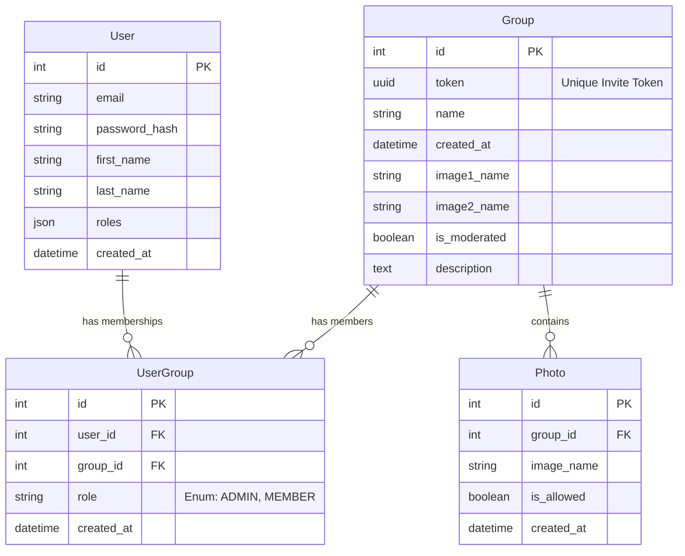

# 📸 PhotoParty

**PhotoParty** is a real-time web application designed for events. It allows a group of people to capture photos from their smartphones and instantly display them on a live video projector feed. The entire ecosystem is managed by group administrators who can control settings, invite members, and moderate content.

## 🎯 Project Objectives

This project was built to learn and master the **Symfony** framework. Moving beyond basic concepts, the goal was to create a concrete, full-stack application involving:
*   **Architecture:** Implementation of Controllers, Entities, and complex relationships with Doctrine.
*   **Real-time:** Integration of the **Mercure** protocol for live event broadcasting.
*   **API:** Creation of a lightweight internal API to manage photo status updates asynchronously. (WIP)
*   **Frontend:** Modern UI using Twig, **Tailwind CSS**, and **Alpine.js**.

---

## 🛠 Tech Stack

*   **Backend:** PHP 8.2+, Symfony 6/7
*   **Database:** MySQL / MariaDB (Doctrine ORM)
*   **Real-time:** Mercure Hub
*   **Frontend:** Twig, Tailwind CSS, Alpine.js
*   **File Handling:** VichUploaderBundle

---

## 💾 Database Schema

Here is the relational diagram of the application:



---

## 🚀 Installation & Setup

### Prerequisites
*   PHP 8.1+ & Composer
*   Node.js (for asset compilation if needed)
*   Mercure Hub (binary or Docker)

### 1. Database Setup
```bash
# Create the database
php bin/console doctrine:database:create

# Execute migrations
php bin/console doctrine:migrations:migrate

# Load dummy data (Fixtures)
php bin/console doctrine:fixtures:load
```

### 2. Tailwind CSS Setup
*Note: A specific fix for Windows environments regarding the Tailwind binary.*

1.  Download version **3.4.18** of Tailwind CSS: [GitHub Releases](https://github.com/tailwindlabs/tailwindcss/releases)
2.  Replace the existing file in `/var/tailwind/{version}/tailwindcss-windows-x64.exe` with the downloaded file.
3.  Build the assets:
    ```bash
    php bin/console tailwind:build
    # Or watch for changes:
    php bin/console tailwind:build --watch
    ```

### 3. Start the Server
```bash
symfony server:start
```

---

## 🗺 Roadmap & Features

### ✅ V1 - Core Features (Completed)
- [x] **Database Architecture**: Entities & Relations created.
- [x] **Authentication**: Login/Register forms using Symfony Security.
- [x] **Group Management**: Create groups, assign Admin role automatically.
- [x] **Invitations**: Shareable links/tokens for users to join groups.
- [x] **Photo Upload**: Integration of `VichUploaderBundle` (Server-side storage).
- [x] **Real-time (WIP)**: Mercure event emission upon upload.
- [x] **Projection**: `/projecteur` route to listen to Mercure events.
- [x] **Moderation API**: Simple API endpoint to toggle photo visibility (`isAllowed`).

### 🚧 V2 - Upcoming Features
- [ ] **Advanced Moderation**: Admin dashboard to approve/reject photos before they appear on screen (Pre-moderation).
- [ ] **AI Filtering**: Automatic detection of explicit content (NSFW) to filter images for all audiences.
- [ ] **Payment System**: Integration of a `/shop` route with Stripe for premium features (e.g., storage limits, custom branding).
- [ ] **AJAX Persistence**: Finalize the connection between the Alpine.js frontend and the API for instant moderation updates.

---

## 🎨 Design System (DA)

The project uses a festive and modern color palette implemented via **Tailwind CSS**.

**Typography:**
*   Headers: *Poppins* (via Google Fonts)
*   Body: *Sans-serif*

**Color Palette:**
The UI relies on a gradient background and vibrant accents.

| Color Name | Hex Code | Usage |
| :--- | :--- | :--- |
| **Party Purple** | `#8a2be2` | Primary buttons, text accents, gradients |
| **Party Pink** | `#ff007f` | Gradients, error states, highlights |
| **Party Blue** | `#4169e1` | Secondary buttons, information badges |
| **Slate (bg)** | `#f8fafc` | Application background (Light mode) |

**CSS Gradient Animation:**
The login and account pages feature a dynamic moving gradient:
```css
background: linear-gradient(-45deg, #4b0082, #8a2be2, #4169e1, #00ced1);
animation: gradient 15s ease infinite;
```

---

## 🤖 Disclaimer: AI Usage

This project was developed with the assistance of Artificial Intelligence tools.
*   **Frontend:** AI was extensively used to generate **Tailwind CSS** classes, responsive layouts (Grid/Flex), and **Alpine.js** interactivity to accelerate the design process.
*   **Backend:** AI assisted in Docker setup
